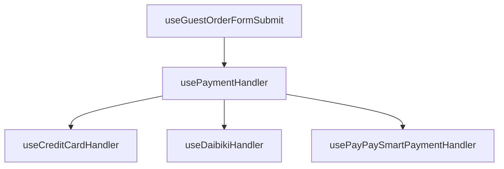

:::message
本稿は、[ZOZO Advent Calendar 2025](https://qiita.com/advent-calendar/2025/zozo) シリーズ 6 の 15 日目の記事です。
:::

## 背景・課題

ZOZOTOWN のゲスト注文フローでは、複数の決済手段（クレジットカード、代金引換、PayPay 決済）をサポートする必要がありました。
各決済手段は異なる要件を持っており、これらを単一のフックやコンポーネントで管理すると、以下の問題が発生していました。

- 条件分岐が複雑化し、可読性が低下
- 新しい決済手段の追加が困難
- 特定の決済手段の修正が他の決済手段に影響するリスク
- テストコードの記述が困難

本記事では、実務の中で遭遇した上記課題を React Hooks × Strategy Pattern で整理した過程を紹介します。

## 整理する前の条件分岐だけによる関数

クレジットカード固有の処理と代金引換の処理が submit 処理内で分岐しています。
この処理に新しい決済方法（例えば PayPay）を追加する場合、さらに分岐が増えることになります。

```ts:useGuestOrderFormSubmit.ts
export const useGuestOrderFormSubmit = ({ header, onBeforeSubmit, ... }) => {
    const { trigger } = usePostGuestsOrder()

    const submit = useMemo(() => {
      return handleSubmit(async (data) => {
        // バリデーション...

        // クレジットカード固有の処理（不正検知やトークン取得）
        const tokenResponse = await creditCardPreparation(data /* ... */);
        const oneTimeToken = tokenResponse
        ? base64URIEncode(JSON.stringify(tokenResponse))
        : undefined

        // PayPayを追加する場合
        if (data.payment_method_type === 'paypay') {
          // PayPay固有の処理
        }

        // 注文処理のリクエストBodyの生成
        const requestBody = convertPostGuestOrderRequestBody(data, {
        /* ... */
        oneTimeToken, // ⚠️ トークンはクレジットカード以外では不要だが、現状は常に渡している
      })

        // 注文処理
        const result = await trigger(header, requestBody);
      })
    }, [/* dependencies */])

    return { submit, isLoading: isSubmitting.current }
  }
```

これらの問題を Strategy Pattern + Custom Hooks を使って整理しました。

## アーキテクチャ概要

リファクタリングでは、Strategy Pattern を採用し、決済手段ごとの処理を完全に分離しました。



## Strategy Pattern の実装

### ステップ 1: 共通インターフェースの定義

すべての決済手段が実装すべきインターフェースを型定義で宣言します。
この PaymentHandler 型がすべての決済手段の Hooks が返すべき関数の型となります。

```ts:types.ts
// 決済手段の種類
export type payment_method_type =
  | "DAIBIKI"
  | "CREDIT_CARD"
  | "PAYPAY_SMART_PAYMENT";

export type GuestOrderParams = {
  header: RequestHeader; // 注文処理に必要なリクエストヘッダー
  data: GuestOrderFormSchema; // 注文処理に必要なデータ
};

export type GuestOrderCallbacks = {
  onLoadingStart: () => void; // ローディング開始
  onLoadingEnd: () => void; // ローディング終了
  onSuccess: (result: GuestOrderResult) => void; // 成功時の後処理
  onError: (result: GuestOrderError) => void; // エラー時の後処理
  onRedirectToExternal: (url: string) => void; // 外部リダイレクト時
};

export type PaymentHandler = (
  params: GuestOrderParams,
  callbacks: GuestOrderCallbacks
) => Promise<void>;
```

### ステップ 2: 各決済手段の Hooks を作成

次に、各決済手段ごとに専用の Custom Hooks を作成します。それぞれが PaymentHandler 型の関数を返すように実装します。
各 Hooks は、決済手段固有のロジックを内包しながらも、同じ PaymentHandler 型の関数を返すことで、統一的なインターフェースを保っています。

#### 代金引換の例

```ts:useDaibikiHandler.ts
export const useDaibikiHandler = (): PaymentHandler => {
  const { trigger } = usePostGuestsOrder();

  return useCallback(
    async ({ header, data }, { onLoadingStart, onSuccess, onError }) => {
      onLoadingStart();

      // 代金引換固有の処理...
      const requestBody = convertPostGuestOrderRequestBody(/* ... */);
      const result = await trigger(header, requestBody);

      // 結果に応じてコールバックを呼び出し
      if (!result) {
        onError(createGuestOrderAPIError(result));
        return;
      }
      onSuccess(result);
    },
    [
      /* dependencies */
    ]
  );
};
```

#### クレジットカードの例

```ts:useCreditCardHandler.ts
export const useCreditCardHandler = (): PaymentHandler => {
  const { trigger } = usePostGuestsOrder();

  return useCallback(
    async (
      { header, data },
      { onLoadingStart, onSuccess, onError, onRedirectToExternal }
    ) => {
      onLoadingStart();

      // クレジットカード固有の処理（トークン取得、不正検知など）...
      const tokenResponse = await creditCardPreparation(data /* ... */);
      const result = await trigger(/* ... */);

      // 3DS認証が必要な場合は外部リダイレクト
      if (isURL(result.redirect.url)) {
        onRedirectToExternal(result.redirect.url);
        return;
      }

      onSuccess(result);
    },
    [
      /* dependencies */
    ]
  );
};
```

#### PayPay の例

```ts:usePayPaySmartPaymentHandler.ts
export const usePayPaySmartPaymentHandler = (): PaymentHandler => {
  const { trigger } = usePostGuestsOrder();

  return useCallback(
    async (
      { header, data },
      { onLoadingStart, onSuccess, onError, onRedirectToExternal }
    ) => {
      onLoadingStart();

      // PayPay固有の処理
      /* 認証 */
      /* PayPayアプリまたはブラウザに遷移 */
      /* 決済時ポーリング処理 */
      const result = await trigger(/* ... */);

      onSuccess(result);
    },
    [
      /* dependencies */
    ]
  );
};
```

### ステップ 3: Strategy Context の実装

各決済手段の Hooks が作成できたら、それらをまとめる Strategy Context を実装します。
Record 型を使用することで、TypeScript の型システムが全決済手段の実装漏れをコンパイル時に検出します。

```ts:usePaymentHandler.ts
export const usePaymentHandler = () => {
  const handler: Record<Schemas.payment_method_type, PaymentHandler> = {
    DAIBIKI: useDaibikiHandler(),
    CREDIT_CARD: useCreditCardHandler(),
    PAYPAY_SMART_PAYMENT: usePayPaySmartPaymentHandler(),
  };

  const placeOrder = (
    paymentMethod: Schemas.payment_method_type,
    params: GuestOrderParams,
    callbacks: GuestOrderCallbacks
  ) => handler[paymentMethod](params, callbacks);

  return { placeOrder };
};
```

### ステップ 4: エントリーポイントからの呼び出し

選択された支払い方法ごとの Strategy (決済固有のロジック)で処理されます。
各 Strategy は決済固有のロジックに集中し、UI 制御や状態管理は親フックに委譲します。
onRedirectToExternal は、クレジットカードの 3DS 認証など、外部サイトへのリダイレクトが必要なケースに対応するために用意しました。

```ts:useGuestOrderFormSubmit.ts
export const useGuestOrderFormSubmit = ({ header, onBeforeSubmit, ... }) => {
    const { placeOrder } = usePaymentHandler()

    const submit = useMemo(() => {
      return handleSubmit(async (data) => {
        // バリデーション...

        await placeOrder(
          data.payment_method_type,
          { header, data },
          {
            onLoadingStart: () => { onBeforeSubmit() },
            onLoadingEnd: () => { onSubmitComplete() },
            onSuccess: handleSuccess,
            onError: handleError,
            onRedirectToExternal: (url: string) => {
              isSubmitting.current = false
              location.href = url
            },
          }
        )
      })
    }, [/* dependencies */])

    return { submit, isLoading: isSubmitting.current }
  }
```

各決済手段から返されるエラーは、型定義で統一されています。

```ts
export type GuestOrderError =
  | { errorCode: "GUEST_ORDER_API_ERROR"; error: unknown }
  | { errorCode: "UNEXPECTED_ERROR"; error: Error }
  | { errorCode: "FAILED_DAIBIKI_ERROR"; error: Error }
  | { errorCode: "FAILED_CREDIT_CARD_ERROR"; error: Error };
```

Union 型により、エラーコードごとの処理が型安全に記述できるようにしています。

```ts
const handleError = useCallback((errorResponse: GuestOrderError) => {
    switch (errorResponse.errorCode) {
      case 'UNEXPECTED_ERROR':
        // 共通のエラー処理
        break
      case 'FAILED_CREDIT_CARD_ERROR':
        // クレジットカード固有のエラー処理
        break
      // ...
    }
  }, [...])
```

## 成果

リファクタリング後、以下の具体的な改善が得られました。

### 保守性の向上

- 新しい決済手段の追加時、既存コードへの影響なく実装可能になりました。
- 各決済処理の変更が他の決済手段に影響しないようになりました。
- 各決済手段ごとに独立してテストが可能になりました。

### 可読性の向上

- 1 つの巨大なフックから、責務ごとに分割された複数のファイル構成となりました。
- 決済手段ごとのファイル分割しているのでコードの所在が明確になりました。
- if/else の代わりに Strategy を追加することで条件分岐の削減ができました。

## 設計のポイント

### React Hooks と Strategy Pattern の融合

従来のクラスベースの Strategy Pattern では、各 Strategy をクラスとしてインスタンス化しますが、今回は Custom
Hooks を活用することで以下を実現しました。

- React の他の Hooks（useDevice, useRouter など）を自然に利用可能
- useCallback によるメモ化で不要な再生成を防止
- 依存性の注入がフックの引数や他のフックの呼び出しで表現可能

### 責務の明確な分離

- Strategy 層（各 Handler）で決済手段固有のビジネスロジックのみに集中
- Context 層（usePaymentHandler）は Strategy の選択ロジックのみを担当
- Client 層（useGuestOrderFormSubmit）で UI 制御、フォーム状態、エラー表示など、決済に依存しない横断的関心事を管理

この明確な責務分離により、各層が独立してテスト・変更可能になりました。

## 終わりに

複雑な決済フローを React Hooks と Strategy Pattern で整理することで、拡張性・保守性・可読性・型安全性の大幅な向上を実現できました。
